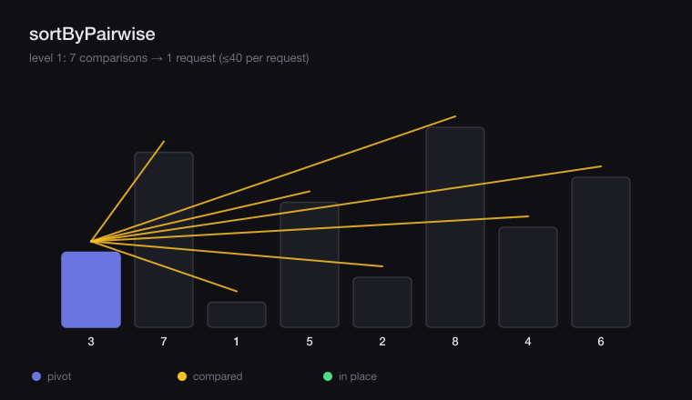
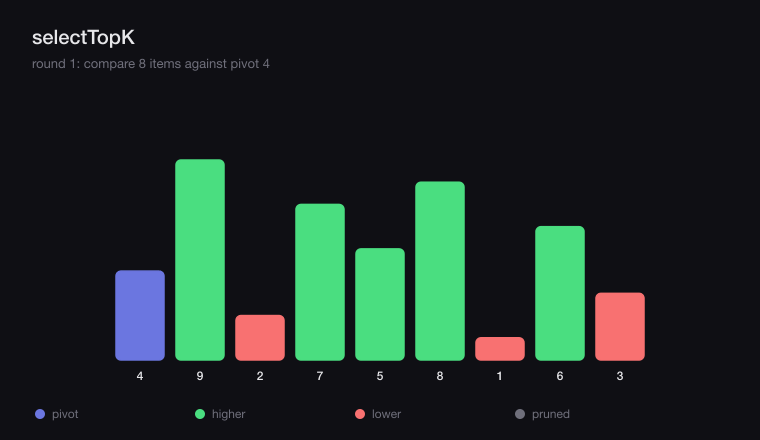
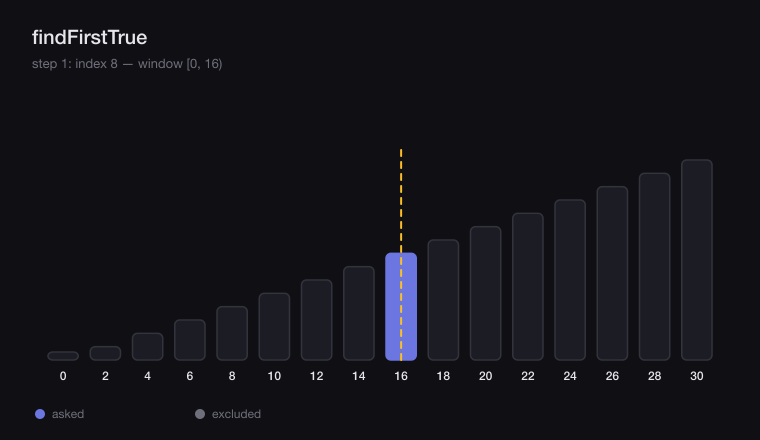
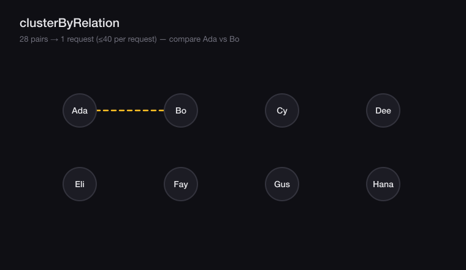

# jev-algorithms

Runtime-agnostic algorithms built on TypeSafe's [Jev](https://developers.cloudflare.com/ai/models/typesafe/jev/)
structured-evaluation model.

Jev does not generate prose. You hand it one `state` and a map of typed
questions, and it returns one answer per question: a probability for Noul, a
picked option for Choice, a position on a scale for Score. That is a tiny
primitive. This package turns it into the algorithms you actually want —
sorting, top-k, threshold search, ranking, clustering, classification, and
matching — and keeps the number of Jev calls small by batching many questions
into one request.

The package depends on nothing. Bring a `JevClient`; adapters ship for the
TypeSafe HTTP API and for a Cloudflare Workers AI binding, plus an in-memory
double for tests.

## Install

```sh
npm install jev-algorithms
```

## Quick start

```ts
import { createTypeSafeClient, sortByPairwise } from "jev-algorithms";

const jev = createTypeSafeClient({ apiKey: process.env.TYPESAFE_API_KEY! });

const inbox = [
  { id: "1", from: "ceo@acme.com", subject: "Contract", unread: true, body: "Please sign by Friday." },
  { id: "2", from: "news@acme.com", subject: "Weekly digest", unread: false, body: "This week in..." },
];

const ordered = await sortByPairwise(jev, inbox, {
  task: "for replying first",
  stateOf: (mail) => ({
    from: mail.from,
    subject: mail.subject,
    unread: mail.unread,
    preview: mail.body.slice(0, 300),
  }),
});
// [Contract mail, Weekly digest]
```

## Animations

Each clip is generated from the real algorithm: the code in `dist` is run
against a deterministic oracle, every comparator call is recorded, and the
recording is replayed as frames (`npm run animations`). The request counts in
the captions are the counts the library actually made.

**sortByPairwise** — quicksort partitioned one level per request; each level
compares every active group against its pivot in a single Jev call.



**selectTopK** — quickselect descends only the side that can still hold the
k-th item.



**findFirstTrue** — binary search narrows a monotone predicate in `O(log n)`
requests.



**clusterByRelation** — union-find over pairwise equivalence; all pairs in one
request.



## The client contract

```ts
interface JevClient {
  evaluate(input: { state: JevState; questions: JevQuestions }): Promise<JevAnswers>;
}
```

| Adapter | Factory | Notes |
| --- | --- | --- |
| TypeSafe API | `createTypeSafeClient({ apiKey, model?, baseUrl?, fetch? })` | Runtime-agnostic default. Keep the key on the server. |
| Workers AI | `createWorkersAiClient(binding, model?)` | Pass `env.AI`. Structural, no Cloudflare types required. |
| In memory | `createMemoryClient(responder)` | Test double; records every `calls` evaluation. |

Question builders (`noul`, `choice`, `score`) and answer readers
(`readNoul`, `readChoice`, `readScore`) are exported for building your own
algorithms on the same contract.

## Algorithms

Every algorithm states its request cost in terms of `n` items. A request
carries many questions, so "one request" is rarely one comparison.

### Sorting and selection

| Function | What it does | Requests |
| --- | --- | --- |
| `sortByPairwise(client, items, options)` | Total order from pairwise "which ranks higher?" answers | `O(log n)` |
| `sortByPairwiseWith(items, compare)` | Same, with an injected comparator (no client) | `O(log n)` |
| `selectTopK(client, items, k, options)` | Top-k, ordered, via quickselect | `O(log n)` |
| `selectTopKWith(items, k, compare)` | Same, with an injected comparator | `O(log n)` |
| `createPairComparator(client, items, options)` | Build the comparator to plug Jev into any sort you own | — |

The sort is randomized quicksort whose recursion runs level by level. Nodes on
a level are disjoint, so all their pivot comparisons fit in one request — the
whole order costs `~log n` round trips instead of `n log n`. `selectTopK` skips
the side that cannot contain the k-th item.

### Threshold search

```ts
const cutoff = await findFirstTrue(jev, emailsByRecency, {
  stateOf: (mail) => ({ ageDays: mail.ageDays }),
  instruction: "Is `candidate` older than 30 days?",
});
```

`findFirstTrue` binary-searches a monotone predicate in `O(log n)` calls.

### Ranking from noisy comparisons

Pairwise answers can cycle (A > B > C > A). `elo` and `bradleyTerry` turn a
list of `Comparison`s into one score per id; `rankByElo` and
`rankByBradleyTerry` order them. `winner` is `"first" | "second" | "draw"`,
named by position so a player called `"a"` or `"b"` is never ambiguous.

### Clustering

```ts
const groups = await clusterByRelation(jev, tickets, {
  relation: "duplicate support ticket",
  stateOf: (t) => ({ subject: t.subject, body: t.body.slice(0, 300) }),
});
```

Union-find over pairwise equivalence. Every unordered pair is compared once;
`threshold` controls how confident Jev must be to merge, and `maxComparisons`
caps sampling for large inputs.

### Classification and scoring

- `classifyChoice(client, state, { instruction, labels, abstainBelow })` —
  Choice with an abstain band, so uncertain cases can be escalated instead of
  guessed.
- `booleanDecision(client, state, { instruction, threshold })` — Noul plus a
  thresholded verdict.
- `rubricScore(client, state, { instruction, levels })` — Score normalized to
  `0..1`, with the nearest level label.

### Matching

`stableMatching(proposers, receivers, proposerPrefs, receiverPrefs)` is a pure
Gale-Shapley implementation. `buildPreferences(client, choosers, candidates, options)`
builds each side's preference order with pairwise comparisons first.

## Design notes

- **Batch by default.** Every algorithm packs many questions into one
  `evaluate` call and references items through a chunk-local index so a shared
  item travels once.
- **Fail loud, not wrong.** If Jev omits an answer, algorithms throw. They
  never persist a fabricated order. The one exception is up to the caller:
  `classifyChoice` can abstain by design.
- **Persistence is yours.** Algorithms return orders and scores; storing them
  (for example, an integer priority column) is a schema decision, not a library
  one.

## Testing and mutation testing

```sh
npm test        # build + node:test
npm run typecheck
npm run mutation # build + Stryker
```

Tests are judged by mutation coverage, not line coverage: a test only earns its
place if it kills a mutant. Stryker runs with the `command` test runner against
the built `dist` and a break threshold of 80; the current score is ~85%.

Two policies keep the signal honest and the suite lean:

- `StringLiteral` mutants are excluded. Prompts and error wording are content,
  not logic; asserting exact prompt text would make the suite brittle without
  catching real bugs.
- Remaining survivors are equivalent mutants — union-by-size size bookkeeping,
  path compression, and randomized pivot selection that produces the same order
  either way. They are documented rather than chased with tests that assert
  internals.

## Publishing

`.github/workflows/publish.yml` publishes to npm with provenance through GitHub
OIDC trusted publishing on any `v*` tag. No `NPM_TOKEN` is stored; configure the
trusted publisher for this repository on npm, then:

```sh
npm version minor && git push --follow-tags
```

## License

MIT
